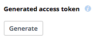
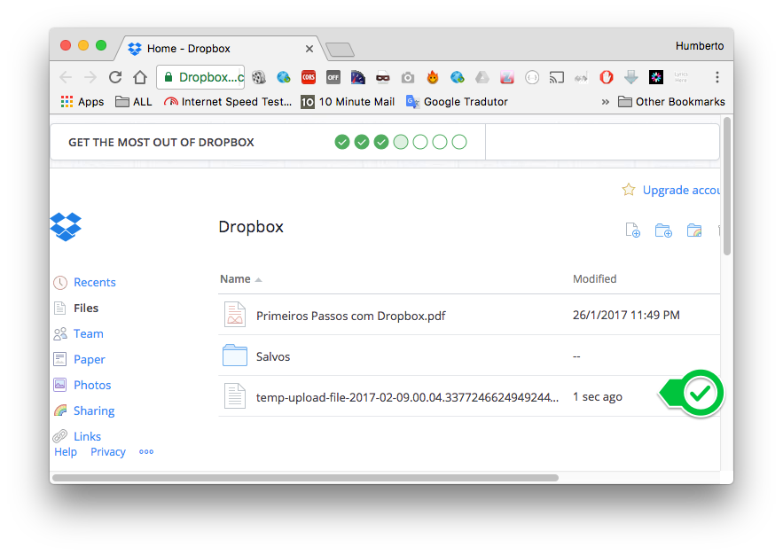

# DropBox Java Client V2

Demo application showing how to use dropbox API in Java.


### Generate

First create an application on App Console:

[https://www.dropbox.com/developers/apps](https://www.dropbox.com/developers/apps)

Then generate and copy your Access Token:




### Run


```
mvn compile exec:java -Dexec.mainClass="com.mycompany.app.App" -Dexec.args="REPLACE_FOR_ACCESS_TOKEN"
```

Don't forget to replace **REPLACE_FOR_ACCESS_TOKEN** for your generete access token.

### Info

```
[INFO] --- exec-maven-plugin:1.5.0:java (default-cli) @ my-app ---
Account Name: Humberto Dias
[List Files]
/salvos
/primeiros passos com dropbox.pdf
[INFO] ------------------------------------------------------------------------
[INFO] BUILD SUCCESS
[INFO] ------------------------------------------------------------------------
[INFO] Total time: 9.080 s
[INFO] Finished at: 2017-02-09T00:04:35-02:00
[INFO] Final Memory: 14M/209M
[INFO] ------------------------------------------------------------------------
```

### Output

1. Get User

	```
	Account Name: Humberto Dias
	```
	
2. List Drop Files
	
	```
	[List Files]
	/salvos
	/primeiros passos com dropbox.pdf
	```

3. Upload an temporary file

	


# References

[DropBox for Developers](https://www.dropbox.com/developers)